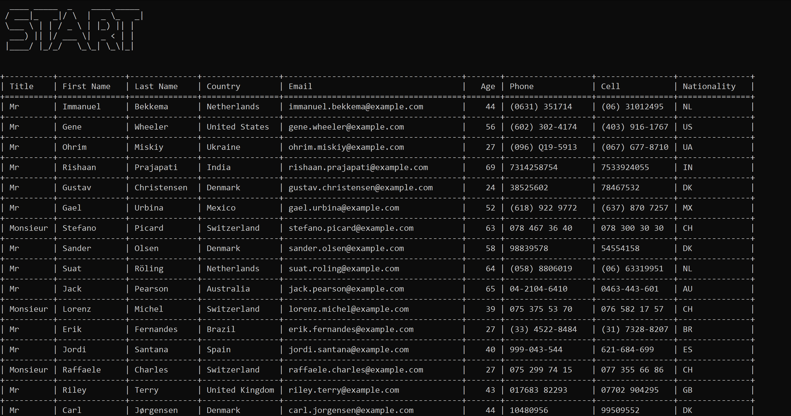

# Python Script to Retrieve and Display Top 100 Male Users from RandomUser API

This Python script uses the RandomUser API, the requests python package, and the tabulate python package to retrieve and list the top 100 male users. The project demonstrates how to access and parse API data using Python, as well as how to filter and manipulate data to display only the desired information.

In addition to the main code file, the repository also contains a requirements.txt file listing the required Python packages, a README.md file with instructions on how to run the code and additional information about the project and .vscode folder which contains setting for VSCode using the Black python formatter and Isort.



# Getting Started

To run this project, you will need to have Python 3.10.4 or higher installed on your machine. You can download Python from the official website: https://www.python.org/downloads/

To install the required Python packages, navigate to the project directory in your terminal and run the following command:

```sh
pip install -r requirements.txt # This will install the necessary packages to run the script.
```

# Usage example

To run the script, navigate to the project directory in your terminal and run the following command:

```python

python main.py # In Windows
python3 main.py # In Linux and Mac

```

This will retrieve the top 100 male users from the RandomUser API and display them in a formatted table in your terminal. If you would like to customize the output, you can modify the code in the main.py file.

# Credits

- [Text to ASCII Art Generator (TAAG) (https://patorjk.com/software/taag/)](https://patorjk.com/software/taag/)
- [Random user data (https://randomuser.me/)](https://randomuser.me/)

# Author

The author of this project is Richard Odhiambo.

You can find me here at:
[Github](https://github.com/o-richard)

# License

This project is licensed under the MIT License. See the LICENSE file for more information.